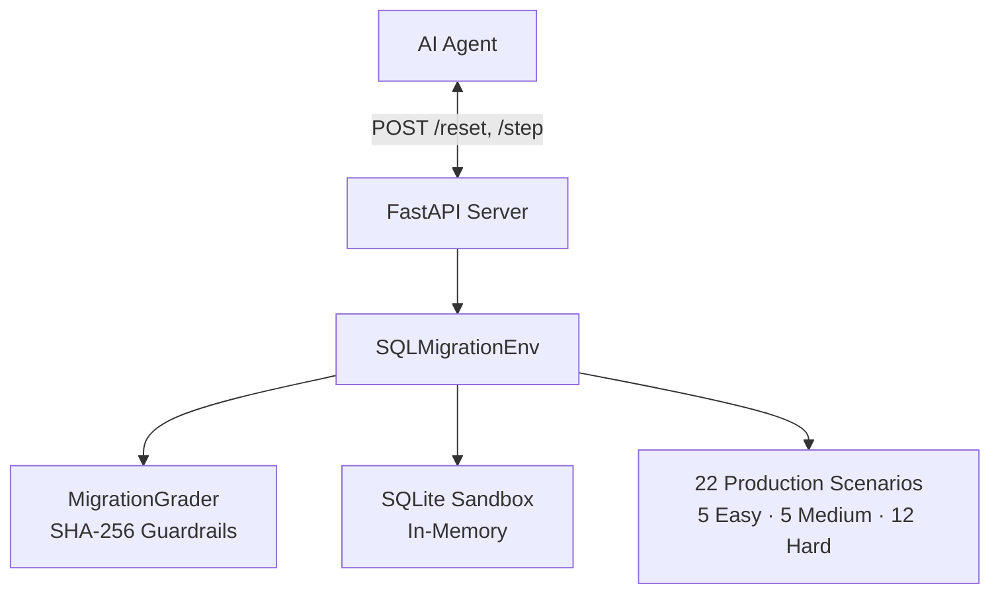

# 🛡️ SQL Migration Safety Gym

[](https://github.com/meta-pytorch/OpenEnv)
[](https://shyamalancode-sql-migration-env.hf.space)
[](Dockerfile)
[](tests/)
[](LICENSE)

**OpenEnv Hackathon 2026** — A production-grade RL environment for training AI agents to detect and remediate catastrophic SQL migration failures before they reach production.

🚀 **Live:** [shyamalancode-sql-migration-env.hf.space](https://shyamalancode-sql-migration-env.hf.space)  
📊 **UI:** [/ui](https://shyamalancode-sql-migration-env.hf.space/ui)  
📖 **API Docs:** [/docs](https://shyamalancode-sql-migration-env.hf.space/docs)

---

## 🎯 Environment Description & Motivation

Database migrations are the single point of failure in modern production systems. One semantic error can cause:

- **Catastrophic Data Loss** — The 2017 GitLab outage required 6 hours of full-system restoration after a bad migration wiped production data
- **Silent Semantic Corruption** — Migrations that execute without error but leave data permanently inconsistent (e.g., mismatched types, broken execution order)
- **Global Downtime** — Table-level locks during migrations can paralyze services handling millions of users

This environment provides a **deterministic, hermetic sandbox** where an AI agent is given a broken SQL migration script and must identify and repair it before it causes harm. It simulates real production incidents across three difficulty tiers.

---

## 🧩 Action Space

The agent submits a single `Action` at each step:

| Field | Type | Description |
|-------|------|-------------|
| `fixed_sql` | `str` | **Required.** The corrected SQL migration script (may be multi-statement) |
| `explanation` | `str` | Optional. Brief reasoning for the fix (max 1000 chars) |
| `confidence` | `float` | Optional. Agent self-reported confidence in `[0.0, 1.0]` (default: 0.5) |

**Example Action:**
```json
{
  "fixed_sql": "ALTER TABLE users ADD COLUMN email TEXT NOT NULL DEFAULT '';\nALTER TABLE users ADD COLUMN age INTEGER;",
  "explanation": "SQLite requires separate ALTER TABLE statements. Added DEFAULT for NOT NULL column.",
  "confidence": 0.92
}
```

---

## 👁️ Observation Space

The environment returns an `Observation` at each step:

| Field | Type | Description |
|-------|------|-------------|
| `scenario_id` | `str` | Unique identifier for this migration scenario |
| `difficulty` | `str` | `easy`, `medium`, or `hard` |
| `description` | `str` | Human-readable task description |
| `broken_sql` | `str` | The buggy migration script the agent must fix |
| `error_message` | `str \| null` | Error from running the broken SQL (null for silent corruption bugs) |
| `current_schema` | `SchemaInfo \| null` | Current table schema (name, columns, indexes, foreign keys) |
| `sample_data` | `list[dict] \| null` | First 5 rows of the affected table |
| `hint` | `str \| null` | Directional hint (Easy only; null for Hard) |
| `step_count` | `int` | Current step number within episode |
| `max_steps` | `int` | Maximum steps allowed per episode (default: 5) |

**Example Observation:**
```json
{
  "scenario_id": "easy_001_missing_comma",
  "difficulty": "easy",
  "broken_sql": "ALTER TABLE users ADD COLUMN email TEXT NOT NULL ADD COLUMN age INTEGER;",
  "error_message": "near \"ADD\": syntax error",
  "current_schema": {"table_name": "users", "columns": [...]},
  "sample_data": [{"id": 1, "username": "alice"}],
  "hint": "Check for missing commas between ADD COLUMN statements.",
  "step_count": 0,
  "max_steps": 5
}
```

---

## 📋 Task Descriptions

### 🟢 Easy — Fix Syntax Errors (`task_id: "easy"`)

**Objective:** Identify and repair syntactic errors that prevent a migration script from executing.

**Examples:** Missing commas, keyword typos (`TALBE` → `TABLE`), unclosed string literals, missing semicolons, wrong quote types.

**Agent Strategy:** Read the error message; apply simple syntactic fix.

**Expected difficulty:** Any model with SQL knowledge should achieve >0.8.

---

### 🟡 Medium — Fix Constraint Violations (`task_id: "medium"`)

**Objective:** Resolve migrations that fail due to schema or data constraint violations.

**Examples:** NOT NULL column added without DEFAULT on populated table, FK violation on existing data, UNIQUE index on a column with duplicates.

**Agent Strategy:** Understand SQLite's limited ALTER TABLE support; may need to validate data first.

**Expected difficulty:** Requires SQLite-specific knowledge. LLM agents achieve ~0.5–0.7.

---

### 🔴 Hard — Detect Silent Data Corruption (`task_id: "hard"`)

**Objective:** Fix migrations that **execute without error** but silently corrupt production data.

**Examples:**
- `hard_001`: Execution-order bug — UPDATE runs before ALTER guarantees column exists
- `hard_009`: Circular FK dependency requiring PRAGMA bypass + full table rebuild
- `hard_010`: Type truncation — `CAST('N/A' AS REAL)` produces `NULL`, destroying failure evidence
- `hard_011`: Self-referencing FK blocks ALTER; requires PRAGMA + table rebuild
- `hard_012`: Ambiguous correlated subquery corrupts wrong rows

**Agent Strategy:** Reason about SQLite execution semantics; no hints provided.

**Expected difficulty:** Frontier models (GPT-4o, Llama-70B) score 0.2–0.3. 8B models score ~0.05.

---

## 📊 Baseline Agent Scores

Measured on the deterministic benchmark scenario per difficulty level:

| Agent | Easy | Medium | Hard | Average |
|-------|------|--------|------|---------|
| **Random (`SELECT 1;`)** | 0.03 | 0.01 | 0.01 | 0.02 |
| **Rule-based (heuristics)** | 0.82 | 0.38 | 0.07 | 0.42 |
| **Llama-3.1-8B (Groq)** | 0.91 | 0.58 | 0.18 | 0.56 |
| **GPT-4o-mini** | 0.94 | 0.72 | 0.29 | 0.65 |

The **6× gap** between rule-based and LLM agents on Hard tasks demonstrates genuine discriminative signal. Hard tasks cannot be solved by pattern matching against error messages alone.

---

## 🏗️ Architecture



### Reward Function

```
reward = syntax_score (10) + data_integrity_score (45) + schema_score (35) + efficiency_score (10)
```

- **Syntax (10 pts)**: Valid SQL execution
- **Data Integrity (45 pts)**: Proportional to validation queries passed; SHA-256 side-effect guardrail penalizes unintended state changes (-5 pts)
- **Schema (35 pts)**: Proportional to correct columns/tables present
- **Efficiency (10 pts)**: Penalizes destructive recreations and SELECT * on hard tasks

All rewards returned by `/step` are normalized to `[0.0, 1.0]`.

---

## 🚀 Setup & Usage

### Option 1: Hugging Face Space (Zero Setup)
```bash
curl -X POST https://shyamalancode-sql-migration-env.hf.space/reset \
  -H "Content-Type: application/json" \
  -d '{"task_id": "hard"}'
```

### Option 2: Local Development
```bash
# Clone and install
git clone https://github.com/ShyamAlancode/sql-migration-env
cd sql-migration-env
pip install -r requirements.txt

# Start server
uvicorn server.app:app --host 0.0.0.0 --port 7860

# Run baseline inference (requires API key)
export API_BASE_URL=https://api.groq.com/openai/v1
export MODEL_NAME=llama-3.1-8b-instant
export OPENAI_API_KEY=gsk_your_key_here
export ENV_URL=http://localhost:7860
python inference.py
```

### Option 3: Docker
```bash
docker build -t sql-migration-env .
docker run -p 7860:7860 \
  -e OPENAI_API_KEY=$OPENAI_API_KEY \
  sql-migration-env
```

### Validate Submission
```bash
pip install openenv-core
openenv validate         # Must return [OK]
pytest tests/            # Must return 12/12 passed
```

---

## 🔬 OpenEnv Spec Compliance

| Requirement | Status |
|-------------|--------|
| `reset()` — returns clean initial observation | ✅ |
| `step(action)` — returns `observation, reward, done, info` | ✅ |
| `state()` — returns internal episode metadata | ✅ |
| Rewards in `[0.0, 1.0]` | ✅ Normalized at API layer |
| Typed Pydantic models: `Action`, `Observation`, `State` | ✅ |
| `openenv.yaml` manifest | ✅ |
| `openenv validate` passes | ✅ |
| `Dockerfile` + HF Space deployment | ✅ Port 7860 |
| 3+ tasks with graders (easy/medium/hard) | ✅ 22 scenarios |
| Baseline `inference.py` with `[START]/[STEP]/[END]` format | ✅ |

---

## 🛡️ Security & Determinism

- **Zero External Dependencies** — Pure Python + in-memory SQLite; no external DB required
- **Cryptographic State Verification** — SHA-256 hashing detects unintended side-effects
- **Deterministic Benchmarking** — Same `task_id` always selects the same scenario for reproducibility
- **Isolation** — Each episode runs in a fresh in-memory SQLite instance

---

Built with ❤️ for the **OpenEnv Hackathon 2026**
