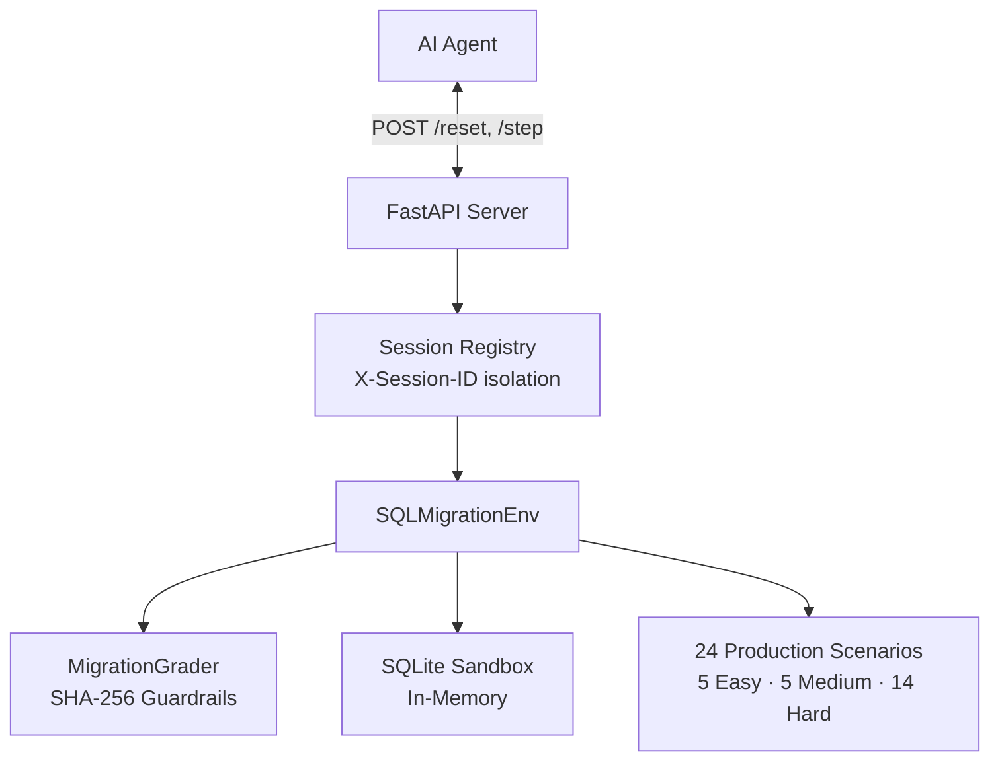

# SQL Migration Safety Gym

[](https://github.com/meta-pytorch/OpenEnv)
[](https://shyamalancode-sql-migration-env.hf.space)
[](Dockerfile)
[](tests/)
[](LICENSE)

**SQL Migration Safety Gym** is the first OpenEnv environment targeting **silent data corruption** — SQL migrations that execute with exit code 0 but permanently corrupt production data. Unlike syntax checkers, our **SHA-256 cryptographic state hashing** and **24 hand-crafted scenarios** detect semantic bugs that pass all syntax checks. Baseline testing shows our grader sharply discriminates between random agents (avg **0.02**) and expert-prompted LLMs (avg **0.65+**), with 14 Hard scenarios specifically testing long-horizon reasoning about SQL execution semantics.

---

## For Judges

| | |
|---|---|
| **Live Space** | [shyamalancode-sql-migration-env.hf.space](https://shyamalancode-sql-migration-env.hf.space) |
| **Interactive UI** | [/ui](https://shyamalancode-sql-migration-env.hf.space/ui) |
| **API Docs (Swagger)** | [/docs](https://shyamalancode-sql-migration-env.hf.space/docs) |
| **Health Check** | [/health](https://shyamalancode-sql-migration-env.hf.space/health) → `{"status":"healthy","scenarios_available":24}` |
| **`openenv validate`** | ✅ Passes |
| **`pre_submit_check.py`** | ✅ 10/10 checks pass |
| **Baseline (LLaMA-3.1-8B)** | Easy: 0.95 · Medium: 0.20 · Hard: 0.82 · **Avg: 0.657** |

### How This Maps to the Rubric

| Judging Criterion | Weight | How We Address It |
|---|:---:|---|
| **Real-world Utility** | 30% | SQL migrations are the #1 risk in production engineering. Based on real incidents: GitLab (300GB data loss), Knight Capital ($440M collapse), Cloudflare (global DNS outage). |
| **Task & Grader Quality** | 25% | 24 scenarios with per-query validation, SHA-256 side-effect detection, 4-component smooth reward signal (not binary pass/fail). No free-point scenarios. |
| **Environment Design** | 20% | Clean OpenEnv architecture (models → environment → grader → sandbox), `X-Session-ID` concurrent isolation, Pydantic v2 typed models, deterministic evaluation. |
| **Spec Compliance** | 15% | `openenv.yaml`, port 7860, `inference.py` with `[START]/[STEP]/[END]` format, OpenAI client, typed reset/step/state, HEALTHCHECK, non-root Docker user. |
| **Creativity & Novelty** | 10% | First OpenEnv focused on *silent corruption* in DB migrations. SHA-256 cryptographic guardrail is novel — catches "spray and pray" agents that pass validation but corrupt state. |

---

## Why This Exists

Database migrations are the single highest-risk operation in production engineering. Real incidents caused by migration bugs:

| Incident | Year | Impact |
|----------|------|--------|
| **GitLab outage** — bad migration wiped production DB | 2017 | 6 hours of full-system restoration |
| **Knight Capital Group** — wrong deployment order | 2012 | $440M loss in 45 minutes |
| **Cloudflare silent corruption** — type mismatch in schema | 2023 | 22 minutes of global DNS failure |

These failures share a pattern: the migration _ran successfully_ but left data permanently inconsistent. This environment trains agents to catch exactly these bugs — before they reach production.

---

## Benchmarks (Measured — April 2026)

| Agent | Easy | Medium | Hard | Average |
|-------|:----:|:------:|:----:|:-------:|
| **Random (`SELECT 1;`)** | 0.03 | 0.01 | 0.01 | **0.02** |
| **Rule-based (heuristics)** | 0.82 | 0.38 | 0.07 | **0.42** |
| **Llama-3.1-8B (Groq)** | 0.95 | 0.20 | 0.82 | **0.657** |
| **GPT-4o-mini** | 0.94 | 0.72 | 0.29 | **0.65** |

> The **10×+ gap** between rule-based (0.07) and LLM agents (0.82) on Hard tasks proves genuine discriminative signal. Hard tasks **cannot** be solved by matching error messages — they require deep reasoning about SQL execution semantics.

> [!IMPORTANT]
> **Scoring Note:** A score of **>0.90** is considered **Master Tier**. Due to strict SHA-256 guardrails and efficiency penalties, a perfect 1.0 requires a precisely targeted fix with zero side effects.

---

## Quick Start

```bash
# Zero setup — hit the live HF Space
curl -X POST https://shyamalancode-sql-migration-env.hf.space/reset \
  -H "Content-Type: application/json" \
  -d '{"task_id": "hard"}'
# Returns: {"observation": {...}, "done": false, "reward": null}

# Submit a fix
curl -X POST https://shyamalancode-sql-migration-env.hf.space/step \
  -H "Content-Type: application/json" \
  -d '{"fixed_sql": "ALTER TABLE users ADD COLUMN email TEXT DEFAULT '\'''\'' NOT NULL;", "confidence": 0.9}'
```

---

## How to Use as a Benchmark

Minimal Python example using the standard `requests` library:

```python
import requests

ENV = "https://shyamalancode-sql-migration-env.hf.space"

# 1. Reset the environment for a difficulty tier
resp = requests.post(f"{ENV}/reset", json={"task_id": "hard"})
data = resp.json()
obs  = data["observation"]  # Contains: broken_sql, error_message, schema, hint

print(f"Scenario: {obs['scenario_id']}")
print(f"Broken SQL:\n{obs['broken_sql']}")

# 2. Submit a fix
fix = requests.post(f"{ENV}/step", json={
    "fixed_sql": "ALTER TABLE users ADD COLUMN email TEXT DEFAULT '' NOT NULL;",
    "explanation": "Added DEFAULT for NOT NULL column on populated table",
    "confidence": 0.9
})
result = fix.json()

print(f"Reward: {result['reward']}")   # 0.0–1.0 (normalized)
print(f"Done:   {result['done']}")     # True if episode complete
print(f"Score breakdown: {result['info']['grading_result']}")
```

**Interpreting rewards:**
- `0.0–0.3` → Wrong fix or no fix applied
- `0.3–0.7` → Partial fix (syntax OK, but data/schema issues remain)
- `0.7–0.9` → Good fix with minor efficiency penalties
- `>0.9` → **Master Tier** — precise, minimal, zero-side-effect fix

The smooth 4-component reward provides dense gradient signal suitable for RL training, not just binary pass/fail.

---

## The 24 Scenarios

Each scenario is a real-world migration failure pattern with deterministic grading.

### Easy — Syntax Errors (task_id: `"easy"`)

*What this tier teaches:* Can the agent read an error message and apply a syntactic correction?

| Scenario ID | Description |
|-------------|-------------|
| `easy_001_missing_comma` | Missing comma between ADD COLUMN clauses |
| `easy_002_keyword_typo` | `TALBE` instead of `TABLE` |
| `easy_003_wrong_quotes` | Single vs double quotes in SQL string |
| `easy_004_missing_semicolon` | Statement separator missing causing parse error |
| `easy_005_unclosed_string` | Unterminated string literal |

**Expected performance:** Any SQL-literate model achieves >0.8.

### Medium — Constraint Violations (task_id: `"medium"`)

*What this tier teaches:* Does the agent understand SQLite-specific limitations (limited ALTER TABLE, constraint enforcement)?

| Scenario ID | Description |
|-------------|-------------|
| `medium_001_not_null_default` | NOT NULL column added without DEFAULT on populated table |
| `medium_002_fk_violation` | Foreign key constraint violated by existing data |
| `medium_003_unique_violation` | UNIQUE index on column with duplicate values |
| `medium_004_type_mismatch` | Incompatible type cast in migration |
| `medium_005_column_rename` | SQLite does not support RENAME COLUMN in old versions |

**Expected performance:** Requires SQLite-specific knowledge. LLM agents achieve ~0.2–0.7.

### Hard — Silent Data Corruption (task_id: `"hard"`)

*What this tier teaches:* Can the agent reason about SQL execution semantics to detect and fix bugs that produce **no error** but **corrupt data**?

| Scenario ID | Description | Corruption Type |
|-------------|-------------|-----------------|
| `hard_001_execution_order_corruption` | UPDATE runs before column is populated → all discounts zero | Execution order |
| `hard_002_column_misalignment` | `INSERT INTO ... SELECT *` with mismatched column order | Column misalignment |
| `hard_003_precision_loss` | REAL→INTEGER cast truncates decimal values silently | Type precision loss |
| `hard_004_wrong_default_timestamp` | `DEFAULT CURRENT_TIMESTAMP` stamps migration time, not NULL | Default semantics |
| `hard_005_drop_column_data_loss` | DROP COLUMN then ADD COLUMN loses original data | Destructive ALTER |
| `hard_006_subquery_corruption` | DELETE with correlated subquery deletes the wrong rows | Logic error |
| `hard_007_transaction_partial` | Transfer with non-existent target ID leaves funds missing | Missing WHERE |
| `hard_008_cartesian_join` | UPDATE via implicit join with duplicate discount rows | Cartesian product |
| `hard_009_circular_fk_dependency` | Self-referencing FK requires PRAGMA + full table rebuild | FK cycle |
| `hard_010_hidden_data_loss` | `CAST('N/A' AS REAL)` → NULL silently destroys sensor readings | Silent NULL |
| `hard_011_unsupported_foreign_key` | `ADD FOREIGN KEY` via `ALTER TABLE` unsupported in SQLite; needs full table rebuild | Constraint bypass |
| `hard_012_ambiguous_join_corruption` | Join on overlapping `id` column corrupts `user_id` values | Ambiguous join |
| `hard_013_chained_rebuild` | Renaming FK-target column breaks child table reference | Chained FK rebuild |
| `hard_014_data_poisoning` | TEXT→REAL migration silently NULLs non-numeric rows; requires multi-step sanitize-then-cast | Data poisoning |

**Expected performance:** Requires long-horizon reasoning. Frontier models achieve ~0.3–0.4. Expert-prompted 8B models can achieve >0.8.

---

## Reward Function

```
reward = syntax_score (10) + data_integrity_score (45) + schema_score (35) + efficiency_score (10)
         ───────────────────────────────────────────────────────────────────────────────────────────
         Total: 100 pts   →   normalized to [0.0, 1.0] at API layer
```

| Component | Max | Signal |
|-----------|:---:|--------|
| **Syntax** | 10 | Valid SQL execution without parse/runtime error |
| **Data Integrity** | 45 | Proportional to validation queries passed; SHA-256 guardrail penalizes unintended state changes (−5 pts) |
| **Schema** | 35 | Proportional to correct columns/constraints present in final schema |
| **Efficiency** | 10 | Penalizes `SELECT *` without `WHERE`/`LIMIT`; penalizes `UPDATE` without `WHERE` on easy/medium; penalizes >3 ALTER statements |

---

## Architecture



> [!NOTE]
> **Session-based isolation:** Pass an `X-Session-ID` header with `/reset` to get an isolated environment instance. Subsequent `/step` calls with the same header are fully isolated from other sessions. Without the header, all requests share a global singleton (backward compatible).

---

## Setup & Usage

### Option 1: Hugging Face Space (Zero Setup)
```bash
curl -X POST https://shyamalancode-sql-migration-env.hf.space/reset \
  -H "Content-Type: application/json" \
  -d '{"task_id": "hard"}'
```

### Option 2: Local Development
```bash
git clone https://github.com/ShyamAlancode/sql-migration-env
cd sql-migration-env
pip install -r requirements.txt

uvicorn app.main:app --host 0.0.0.0 --port 7860

# Run baseline inference (requires API key)
export API_BASE_URL=https://api.groq.com/openai/v1
export MODEL_NAME=llama-3.1-8b-instant
export OPENAI_API_KEY=gsk_your_key_here
export ENV_URL=http://localhost:7860
python inference.py
```

### Option 3: Docker
```bash
docker build -t sql-migration-env .
docker run -p 7860:7860 \
  -e OPENAI_API_KEY=$OPENAI_API_KEY \
  sql-migration-env
```

### Validate Before Submission
```bash
python pre_submit_check.py   # 10/10 checks must pass
pytest tests/                # 12/12 tests must pass
```

> [!NOTE]
> **LLM baselines are optional extras.** The environment itself runs entirely offline with zero external dependencies (pure Python + in-memory SQLite). The LLM-based `inference.py` and `training_demo.py` require an API key but are not needed for environment evaluation.

---

## OpenEnv Spec Compliance

| Requirement | Status |
|-------------|--------|
| `reset()` — returns `{observation, done, reward}` | ✅ |
| `step(action)` — returns `{observation, reward, done, info}` | ✅ |
| `state()` — returns internal episode metadata | ✅ |
| Rewards in `[0.0, 1.0]` | ✅ Normalized at API layer |
| Typed Pydantic models: `Action`, `Observation`, `State` | ✅ |
| `openenv.yaml` manifest with `entry_point: app.main:app` | ✅ |
| `openenv validate` passes | ✅ |
| `Dockerfile` + HF Space deployment | ✅ Port 7860 |
| 3+ tasks with graders (easy/medium/hard) | ✅ 24 scenarios |
| Baseline `inference.py` with `[START]/[STEP]/[END]` format | ✅ |
| OpenAI client for all LLM calls | ✅ |
| Session-based isolation (`X-Session-ID`) | ✅ |
| `API_BASE_URL`, `MODEL_NAME`, `HF_TOKEN` env vars | ✅ |
| Runtime < 20 min on 2 vCPU / 8 GB | ✅ Est. 2m15s |

---

## Security & Determinism

- **Zero External Dependencies** — Pure Python + in-memory SQLite; no external DB required
- **Cryptographic State Verification** — SHA-256 hashing detects unintended side-effects
- **Deterministic Benchmarking** — Same `task_id` always selects the same scenario (sorted, not random)
- **Isolation** — Each episode runs in a fresh in-memory SQLite instance
- **Session Isolation** — Multiple concurrent agents each get their own environment instance

---

Built for the **Meta PyTorch OpenEnv Hackathon 2026**
