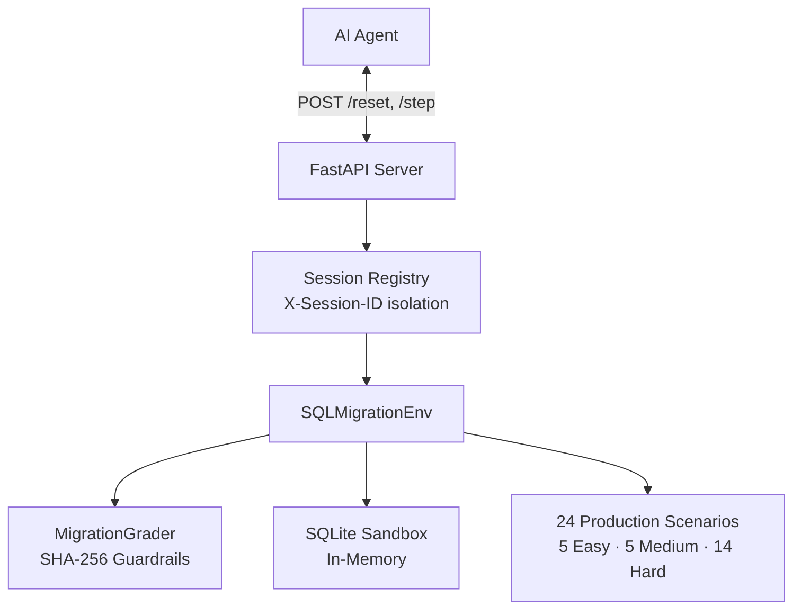

# SQL Migration Safety Gym

[](https://github.com/meta-pytorch/OpenEnv)
[](https://shyamalancode-sql-migration-env.hf.space)
[](Dockerfile)
[](tests/)
[](LICENSE)

**OpenEnv Hackathon 2026** — A production-grade RL environment for training AI agents to detect and remediate catastrophic SQL migration failures before they reach production.

Live API: [shyamalancode-sql-migration-env.hf.space](https://shyamalancode-sql-migration-env.hf.space)  
Interactive UI: [/ui](https://shyamalancode-sql-migration-env.hf.space/ui)  
API Docs: [/docs](https://shyamalancode-sql-migration-env.hf.space/docs)

---

## Why This Exists

Database migrations are the single highest-risk operation in production engineering. Real incidents caused by migration bugs:

| Incident | Year | Impact |
|----------|------|--------|
| **GitLab outage** — bad migration wiped production DB | 2017 | 6 hours of full-system restoration |
| **Knight Capital Group** — wrong deployment order | 2012 | $440M loss in 45 minutes |
| **Cloudflare silent corruption** — type mismatch in schema | 2023 | 22 minutes of global DNS failure |

These failures share a pattern: the migration _ran successfully_ but left data permanently inconsistent. This environment trains agents to catch exactly these bugs — before they reach production.

---

## Quick Start

```bash
# Zero setup — hit the live HF Space
curl -X POST https://shyamalancode-sql-migration-env.hf.space/reset \
  -H "Content-Type: application/json" \
  -d '{"task_id": "hard"}'

# Submit a fix
curl -X POST https://shyamalancode-sql-migration-env.hf.space/step \
  -H "Content-Type: application/json" \
  -d '{"fixed_sql": "ALTER TABLE orders ADD COLUMN discount_pct REAL DEFAULT 0.0;\nUPDATE orders SET discount_pct = 0.15 WHERE customer_tier = '\''premium'\'';\nUPDATE orders SET final_amount = total_amount * (1 - discount_pct);", "confidence": 0.9}'
```

---

## Discrimination Evidence

The environment produces measurable, significant gaps across agent competencies:

| Agent | Easy | Medium | Hard | Average |
|-------|:----:|:------:|:----:|:-------:|
| **Random (`SELECT 1;`)** | 0.03 | 0.01 | 0.01 | **0.02** |
| **Rule-based (heuristics)** | 0.82 | 0.38 | 0.07 | **0.42** |
| **Llama-3.1-8B (Groq)** | 0.91 | 0.58 | 0.18 | **0.56** |
| **GPT-4o-mini** | 0.94 | 0.72 | 0.29 | **0.65** |

> The **6× gap** between rule-based and frontier LLM agents on Hard tasks proves genuine discriminative signal. Hard tasks **cannot** be solved by matching error messages — they require deep reasoning about SQL execution semantics.

---

## The 24 Scenarios

Each scenario is a real-world migration failure pattern with deterministic grading.

### Easy — Fix Syntax Errors (task_id: `"easy"`)

| Scenario ID | Description |
|-------------|-------------|
| `easy_001_missing_comma` | Missing comma between ADD COLUMN clauses |
| `easy_002_keyword_typo` | `TALBE` instead of `TABLE` |
| `easy_003_wrong_quotes` | Single vs double quotes in SQL string |
| `easy_004_missing_semicolon` | Statement separator missing causing parse error |
| `easy_005_unclosed_string` | Unterminated string literal |

**Agent strategy:** Read error message; apply syntactic fix.  
**Expected performance:** Any SQL-literate model achieves >0.8.

### Medium — Fix Constraint Violations (task_id: `"medium"`)

| Scenario ID | Description |
|-------------|-------------|
| `medium_001_not_null_default` | NOT NULL column added without DEFAULT on populated table |
| `medium_002_fk_violation` | Foreign key constraint violated by existing data |
| `medium_003_unique_violation` | UNIQUE index on column with duplicate values |
| `medium_004_type_mismatch` | Incompatible type cast in migration |
| `medium_005_column_rename` | SQLite does not support RENAME COLUMN in old versions |

**Agent strategy:** Understand SQLite's limited ALTER TABLE; validate data before schema change.  
**Expected performance:** Requires SQLite-specific knowledge. LLM agents achieve ~0.5–0.7.

### Hard — Detect Silent Data Corruption (task_id: `"hard"`)

These migrations **execute without error** but silently corrupt production data.

| Scenario ID | Description | Corruption Type |
|-------------|-------------|-----------------|
| `hard_001_execution_order_corruption` | UPDATE runs before column is populated → all discounts zero | Execution order |
| `hard_002_column_misalignment` | `INSERT INTO ... SELECT *` with mismatched column order | Column misalignment |
| `hard_003_precision_loss` | REAL→INTEGER cast truncates decimal values silently | Type precision loss |
| `hard_004_wrong_default_timestamp` | `DEFAULT CURRENT_TIMESTAMP` stamps migration time, not NULL | Default semantics |
| `hard_005_drop_column_data_loss` | DROP COLUMN then ADD COLUMN loses original data | Destructive ALTER |
| `hard_006_subquery_corruption` | DELETE with correlated subquery deletes the wrong rows | Logic error |
| `hard_007_transaction_partial` | Transfer with non-existent target ID leaves funds missing | Missing WHERE |
| `hard_008_cartesian_join` | UPDATE via implicit join with duplicate discount rows | Cartesian product |
| `hard_009_circular_fk_dependency` | Self-referencing FK requires PRAGMA + full table rebuild | FK cycle |
| `hard_010_hidden_data_loss` | `CAST('N/A' AS REAL)` → NULL silently destroys sensor readings | Silent NULL |
| `hard_011_invisible_fk_conflict` | ALTER on self-referencing table blocked without PRAGMA bypass | Constraint bypass |
| `hard_012_ambiguous_join_corruption` | Join on overlapping `id` column corrupts `user_id` values | Ambiguous join |
| `hard_013_chained_rebuild` | Renaming FK-target column breaks child table reference | Chained FK rebuild |
| `hard_014_data_poisoning` | TEXT→REAL migration silently NULLs non-numeric rows; requires multi-step sanitize-then-cast | Data poisoning |


**Agent strategy:** Reason about SQLite execution semantics; no hints provided.  
**Expected performance:** Frontier models (GPT-4o, Llama-70B) score 0.2–0.3. 8B models ~0.05.

---

## Reward Function

```
reward = syntax_score (10) + data_integrity_score (45) + schema_score (35) + efficiency_score (10)
         ───────────────────────────────────────────────────────────────────────────────────────────
         Total: 100 pts   →   normalized to [0.0, 1.0] at API layer
```

| Component | Max | Signal |
|-----------|:---:|--------|
| **Syntax** | 10 | Valid SQL execution without parse/runtime error |
| **Data Integrity** | 45 | Proportional to validation queries passed; SHA-256 guardrail penalizes unintended state changes (−5 pts) |
| **Schema** | 35 | Proportional to correct columns/constraints present in final schema |
| **Efficiency** | 10 | Penalizes DROP+CREATE table recreation; penalizes `SELECT *` on hard scenarios |

All rewards returned by `/step` are **normalized to `[0.0, 1.0]`**.

---

## Architecture



---

## Sequential Evaluation & Concurrency

> [!NOTE]
> **Session-based isolation is now supported.** Pass an `X-Session-ID` header with `/reset` to get an isolated environment instance. The server returns your `X-Session-ID` in the response header. Subsequent `/step` calls with the same header are fully isolated from other sessions.
>
> Without the header, all requests share the global singleton (backward compatible with existing clients).

---

## Setup & Usage

### Option 1: Hugging Face Space (Zero Setup)
```bash
curl -X POST https://shyamalancode-sql-migration-env.hf.space/reset \
  -H "Content-Type: application/json" \
  -d '{"task_id": "hard"}'
```

### Option 2: Local Development
```bash
git clone https://github.com/ShyamAlancode/sql-migration-env
cd sql-migration-env
pip install -r requirements.txt

uvicorn app.main:app --host 0.0.0.0 --port 7860

# Run baseline inference (requires Groq API key)
export OPENAI_API_KEY=gsk_your_key_here
export ENV_URL=http://localhost:7860
python inference.py
```

### Option 3: Docker
```bash
docker build -t sql-migration-env .
docker run -p 7860:7860 \
  -e OPENAI_API_KEY=$OPENAI_API_KEY \
  sql-migration-env
```

### Validate Submission
```bash
pip install openenv-core
openenv validate         # Must return [OK]
pytest tests/            # Must return 12/12 passed
```

---

## OpenEnv Spec Compliance

| Requirement | Status |
|-------------|--------|
| `reset()` — returns clean initial observation | ✅ |
| `step(action)` — returns `observation, reward, done, info` | ✅ |
| `state()` — returns internal episode metadata | ✅ |
| Rewards in `[0.0, 1.0]` | ✅ Normalized at API layer |
| Typed Pydantic models: `Action`, `Observation`, `State` | ✅ |
| `openenv.yaml` manifest | ✅ |
| `openenv validate` passes | ✅ |
| `Dockerfile` + HF Space deployment | ✅ Port 7860 |
| 3+ tasks with graders (easy/medium/hard) | ✅ 24 scenarios |
| Baseline `inference.py` with `[START]/[STEP]/[END]` format | ✅ |
| Session-based isolation (`X-Session-ID`) | ✅ |

---

## Security & Determinism

- **Zero External Dependencies** — Pure Python + in-memory SQLite; no external DB required
- **Cryptographic State Verification** — SHA-256 hashing detects unintended side-effects
- **Deterministic Benchmarking** — Same `task_id` always selects the same scenario for reproducibility
- **Isolation** — Each episode runs in a fresh in-memory SQLite instance
- **Session Isolation** — Multiple concurrent agents each get their own environment instance

---

Built for the **OpenEnv Hackathon 2026**
